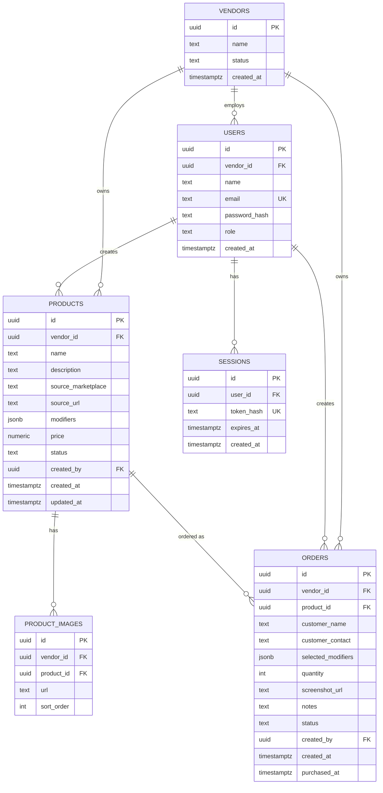

# Data Model

**Status:** Draft v1
**Last updated:** 2026-08-23
**Related:** [PRD.md](./PRD.md), [TECH_STACK.md](./TECH_STACK.md)

Multi-tenant from day one: every table carries a `vendor_id`, even
though the MVP runs with a single vendor. See
[TECH_STACK.md §4](./TECH_STACK.md#4-multi-tenancy--the-decision-that-matters-more-than-tool-choice)
for why.

## 1. ER overview



## 2. Enums

| Enum | Values | Used by |
|---|---|---|
| `user_role` | `admin`, `customer_service`, `supplier` | `users.role` |
| `product_status` | `active`, `archived` | `products.status` |
| `source_marketplace` | `lazada`, `tiktok_shop`, `other` | `products.source_marketplace` |
| `order_status` | `pending`, `purchased`, `cancelled` | `orders.status` |
| `vendor_status` | `active`, `suspended` | `vendors.status` |

MVP note: since it's genuinely one team wearing multiple hats right now
(per PRD §4), all real users can simply be seeded with `role = admin`
until there's an actual reason to restrict permissions by role — the
column exists so that flip is just a data change, not a schema change.

## 3. Tables

### `vendors`
The tenant. One row per business using the platform (just one for now).

| Column | Type | Notes |
|---|---|---|
| `id` | `uuid` PK | |
| `name` | `text` | |
| `status` | `vendor_status` | default `active` |
| `created_at` | `timestamptz` | default `now()` |

### `users`
Staff accounts. Auth is self-rolled for now (see
[TECH_STACK.md §2](./TECH_STACK.md#self-rolled-auth-not-clerk--supabase-auth--deliberately-temporary))
— deliberately plain, portable columns so migrating to a managed
provider later is a data mapping, not a schema rewrite.

| Column | Type | Notes |
|---|---|---|
| `id` | `uuid` PK | |
| `vendor_id` | `uuid` FK → `vendors.id` | |
| `name` | `text` | |
| `email` | `text` UNIQUE | login identifier |
| `password_hash` | `text` | argon2 hash; never store/log the raw password |
| `role` | `user_role` | default `admin` for MVP, see note above |
| `created_at` | `timestamptz` | default `now()` |

**Index:** `(vendor_id)`

### `sessions`
Backs the self-rolled auth's session cookie. A row per active login;
deleting a row (or letting it expire) logs that session out —
supports real revocation, unlike a stateless JWT.

| Column | Type | Notes |
|---|---|---|
| `id` | `uuid` PK | |
| `user_id` | `uuid` FK → `users.id` | `ON DELETE CASCADE` |
| `token_hash` | `text` UNIQUE | hash of the random token stored in the session cookie; never store the raw token |
| `expires_at` | `timestamptz` NOT NULL | e.g. 30 days from creation; extend on activity if desired |
| `created_at` | `timestamptz` | default `now()` |

**Index:** `(token_hash)` for fast lookup on every request; `(user_id)` to support "log out everywhere"

### `products`
The catalog entry — created once by Customer Service, reused across orders.

| Column | Type | Notes |
|---|---|---|
| `id` | `uuid` PK | |
| `vendor_id` | `uuid` FK → `vendors.id` | |
| `name` | `text` NOT NULL | |
| `description` | `text` NOT NULL | |
| `source_marketplace` | `source_marketplace` | nullable until known |
| `source_url` | `text` | nullable — **the highest-leverage field**, see PRD §9.1; lets the Supplier skip manual image search entirely when populated |
| `modifiers` | `jsonb` | shape: `[{"name": "Color", "options": ["Black", "White"]}, {"name": "Size", "options": ["S", "M", "L"]}]`; `[]` if none |
| `price` | `numeric(12,2)` | nullable for MVP |
| `status` | `product_status` | default `active` |
| `created_by` | `uuid` FK → `users.id` | |
| `created_at` | `timestamptz` | default `now()` |
| `updated_at` | `timestamptz` | updated on edit |

**Indexes:** `(vendor_id, status)`, `(vendor_id, name)` for catalog search

### `product_images`
One-to-many, separate table (rather than an array column) so images can
be ordered and a primary image is unambiguous.

| Column | Type | Notes |
|---|---|---|
| `id` | `uuid` PK | |
| `vendor_id` | `uuid` FK → `vendors.id` | denormalized — see §4 |
| `product_id` | `uuid` FK → `products.id` | `ON DELETE CASCADE` |
| `url` | `text` NOT NULL | R2 object URL |
| `sort_order` | `int` | default `0`; index 0 = primary/thumbnail |

**Index:** `(product_id, sort_order)`

### `orders`
A single customer's request, logged by Customer Service against an existing
product (per the locked MVP decision — no ad-hoc orders yet).

| Column | Type | Notes |
|---|---|---|
| `id` | `uuid` PK | |
| `vendor_id` | `uuid` FK → `vendors.id` | denormalized — see §4 |
| `product_id` | `uuid` FK → `products.id` NOT NULL | |
| `customer_name` | `text` NOT NULL | free text — chat name, handle, etc. |
| `customer_contact` | `text` | nullable — phone, social handle |
| `selected_modifiers` | `jsonb` | shape: `{"Color": "Black", "Size": "M"}` |
| `quantity` | `int` NOT NULL | default `1` |
| `screenshot_url` | `text` | nullable — order/chat screenshot, R2 object URL |
| `notes` | `text` | nullable |
| `status` | `order_status` NOT NULL | default `pending` |
| `created_by` | `uuid` FK → `users.id` | the Customer Service |
| `created_at` | `timestamptz` | default `now()` |
| `purchased_at` | `timestamptz` | set when status → `purchased` |

**Indexes:**
- `(vendor_id, status, created_at)` — powers the Supplier's "Today's Pending
  Orders" view
- `(vendor_id, product_id, status)` — powers grouping pending orders by
  product with a running quantity total (PRD §6.3)

## 4. Why `vendor_id` is denormalized onto every table

`orders.vendor_id` and `product_images.vendor_id` are technically
derivable via `product_id` → `products.vendor_id`. They're stored
directly anyway because:

1. **RLS policies stay simple and fast** — every policy is
   `vendor_id = current_setting('app.vendor_id')::uuid` with no join
   required, on every table uniformly.
2. **A single missed join can't leak data.** If a query on `orders`
   ever forgot to join through `products` to check tenant ownership,
   a direct column means the RLS policy still catches it.

## 5. Row-Level Security (defense-in-depth)

Enforced in the app layer (every Drizzle query scopes by `vendor_id`
from the authenticated session) *and* at the database layer via
Postgres RLS, so a bug in the app layer alone can't leak cross-vendor
data:

```sql
alter table products enable row level security;
alter table product_images enable row level security;
alter table orders enable row level security;

-- FORCE, not just ENABLE — see the gotcha below. Without it, this whole
-- section does nothing.
alter table products force row level security;
alter table product_images force row level security;
alter table orders force row level security;

create policy tenant_isolation on products
  using (vendor_id = current_setting('app.vendor_id')::uuid);

create policy tenant_isolation on product_images
  using (vendor_id = current_setting('app.vendor_id')::uuid);

create policy tenant_isolation on orders
  using (vendor_id = current_setting('app.vendor_id')::uuid);
```

The app sets `app.vendor_id` at the start of each request/transaction
by resolving the session cookie → `sessions.user_id` → `users.vendor_id`,
before any query runs.

### Two gotchas that silently defeat all of this if missed

Both were caught by hand — actually inserting cross-vendor fixtures and
confirming a scoped query can't see the other vendor's row — not by reading
the SQL and assuming it works. Worth re-testing this way after any change
near auth, roles, or migrations.

1. **`ENABLE ROW LEVEL SECURITY` alone doesn't apply to the table owner.**
   Postgres exempts a table's owner from its own RLS policies by default.
   Our app must run as **`FORCE ROW LEVEL SECURITY`** too, or connect as a
   role that doesn't own the tables — otherwise every policy above is a
   no-op for exactly the role that matters.
2. **Roles created via the Neon console, CLI, or API get `BYPASSRLS`.**
   They're granted `neon_superuser` membership, which bypasses RLS
   entirely — `FORCE` doesn't help, `BYPASSRLS` wins regardless. The
   app's Postgres role (`app_user`) must be created with **plain SQL**
   (`CREATE ROLE app_user LOGIN PASSWORD '...'`, then explicit `GRANT`s —
   never through Neon's role-management surface), which does *not* grant
   `neon_superuser`. See
   [TECH_STACK.md](./TECH_STACK.md#neon-role-setup-app_user-vs-the-owner-role).

## 6. Deferred (not in MVP schema)

Per PRD §3 and §9 — intentionally not modeled yet, to avoid speculative
schema:

- Payment/deposit status on `orders`
- Extended order lifecycle (`received`, `delivered`, `completed`)
- Multi-Supplier claiming (`claimed_by`, `claimed_at` on `orders`)
- Ad-hoc orders without a `product_id`
- Normalized modifier tables (`modifier_groups` / `modifier_options`) —
  the `jsonb` shape above covers display + grouping needs; only worth
  normalizing if inventory-per-variant tracking is added later
