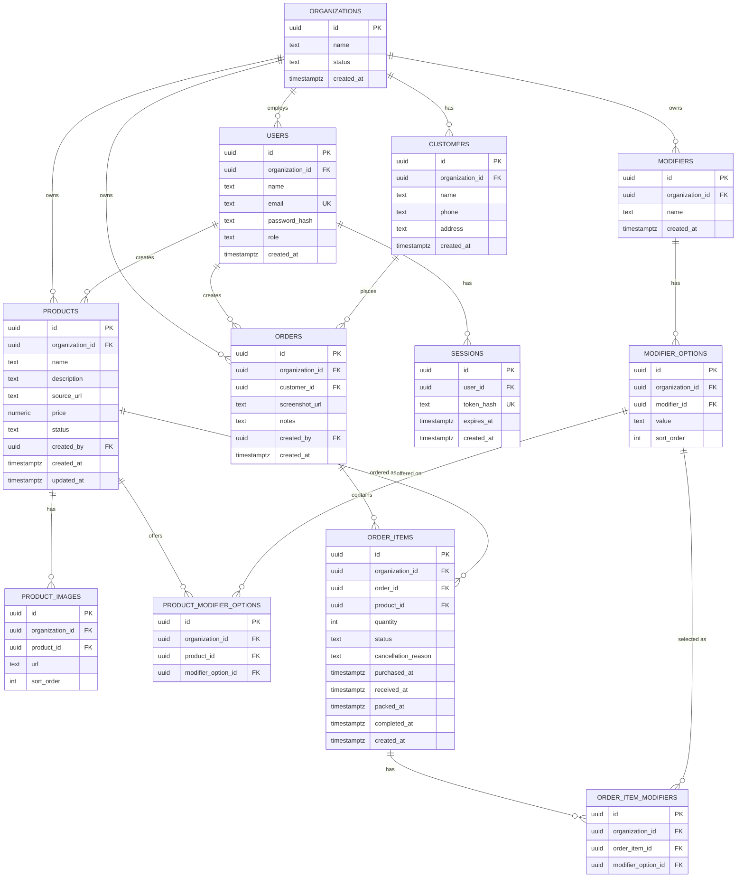

# Data Model

**Status:** Draft v2
**Last updated:** 2026-08-23
**Related:** [PRD.md](./PRD.md), [TECH_STACK.md](./TECH_STACK.md), [CONTEXT.md](./CONTEXT.md), [ADR-0001](./adr/0001-order-item-lifecycle-and-packing.md)

Multi-tenant from day one: every tenant-scoped table carries an
`organization_id`. See
[TECH_STACK.md §4](./TECH_STACK.md#4-multi-tenancy--the-decision-that-matters-more-than-tool-choice)
for why, and §5 below for how it's actually enforced (it's not just the
column).

## 1. ER overview



## 2. Enums

| Enum | Values | Used by |
|---|---|---|
| `organization_status` | `active`, `suspended` | `organizations.status` |
| `user_role` | `customer_service`, `supplier` | `users.role` |
| `product_status` | `active`, `archived` | `products.status` |
| `order_item_status` | `pending`, `purchased`, `received`, `packed`, `completed`, `cancelled` | `order_items.status` |

No `admin` role — PRD §4 deliberately has no in-app account management
for MVP; new users are created by running a script directly against the
database.

## 3. Tables

### `organizations`
The tenant. One row per business using the platform.

| Column | Type | Notes |
|---|---|---|
| `id` | `uuid` PK | |
| `name` | `text` | |
| `status` | `organization_status` | default `active` |
| `created_at` | `timestamptz` | default `now()` |

### `users`
Staff accounts. Auth is self-rolled (see
[TECH_STACK.md §2](./TECH_STACK.md#self-rolled-auth-not-clerk--supabase-auth--deliberately-temporary)).

| Column | Type | Notes |
|---|---|---|
| `id` | `uuid` PK | |
| `organization_id` | `uuid` FK → `organizations.id` | |
| `name` | `text` | |
| `email` | `text` UNIQUE | login identifier |
| `password_hash` | `text` | argon2 hash |
| `role` | `user_role` | `customer_service` or `supplier` |
| `created_at` | `timestamptz` | default `now()` |

**Index:** `(organization_id)`

### `sessions`
Backs the session cookie. See TECH_STACK.md §2 for the design.

| Column | Type | Notes |
|---|---|---|
| `id` | `uuid` PK | |
| `user_id` | `uuid` FK → `users.id` | `ON DELETE CASCADE` |
| `token_hash` | `text` UNIQUE | |
| `expires_at` | `timestamptz` NOT NULL | |
| `created_at` | `timestamptz` | default `now()` |

**Indexes:** `(token_hash)`, `(user_id)`

### `customers`
A real, searchable entity (PRD §5.3) — not free text on the order.

| Column | Type | Notes |
|---|---|---|
| `id` | `uuid` PK | |
| `organization_id` | `uuid` FK → `organizations.id` | |
| `name` | `text` NOT NULL | |
| `phone` | `text` NOT NULL | |
| `address` | `text` | nullable at the DB level only for a handful of test customers that predate this field — required on the create-customer form for everyone going forward; needed to actually ship a Purchased item |
| `created_at` | `timestamptz` | default `now()` |

**Index:** `(organization_id, name)` — powers search-or-create while
logging an order

### `products`
The catalog entry.

| Column | Type | Notes |
|---|---|---|
| `id` | `uuid` PK | |
| `organization_id` | `uuid` FK → `organizations.id` | |
| `name` | `text` NOT NULL | |
| `description` | `text` NOT NULL | |
| `source_url` | `text` | nullable — the highest-leverage field, PRD §9.1. No separate marketplace column; the URL alone is enough. |
| `price` | `numeric(12,2)` | nullable; MMK, customer-facing (PRD §5.1) |
| `status` | `product_status` | default `active` |
| `created_by` | `uuid` FK → `users.id` | |
| `created_at` / `updated_at` | `timestamptz` | |

**Indexes:** `(organization_id, status)`, `(organization_id, name)`

Note the `modifiers` JSONB column from the previous schema draft is
**gone** — modifiers are now relational (see below).

### `product_images`
One-to-many, ordered.

| Column | Type | Notes |
|---|---|---|
| `id` | `uuid` PK | |
| `organization_id` | `uuid` FK | denormalized — see §5 |
| `product_id` | `uuid` FK → `products.id` | `ON DELETE CASCADE` |
| `url` | `text` NOT NULL | R2 object URL |
| `sort_order` | `int` | default `0`; index 0 = primary/thumbnail |

**Index:** `(product_id, sort_order)`

### `modifiers`
An Organization-wide, reusable attribute type (PRD §5.2) — e.g. "Color".
Created inline while creating/editing a Product.

| Column | Type | Notes |
|---|---|---|
| `id` | `uuid` PK | |
| `organization_id` | `uuid` FK | |
| `name` | `text` NOT NULL | e.g. `"Color"` |
| `created_at` | `timestamptz` | |

**Index:** UNIQUE `(organization_id, name)` — prevents creating "Color"
twice by accident from two different inline-creation flows

### `modifier_options`
One value within a Modifier — e.g. "Black" within "Color". The global
list; a Product picks a subset (see `product_modifier_options`).

| Column | Type | Notes |
|---|---|---|
| `id` | `uuid` PK | |
| `organization_id` | `uuid` FK | denormalized |
| `modifier_id` | `uuid` FK → `modifiers.id` | `ON DELETE CASCADE` |
| `value` | `text` NOT NULL | e.g. `"Black"` |
| `sort_order` | `int` | default `0` |

**Index:** UNIQUE `(modifier_id, value)`

### `product_modifier_options`
Join table: which of a Modifier's global Options actually apply to a
given Product. (Which *Modifiers* a Product uses is derivable by joining
through this table — no separate `product_modifiers` table needed.)

| Column | Type | Notes |
|---|---|---|
| `id` | `uuid` PK | |
| `organization_id` | `uuid` FK | denormalized |
| `product_id` | `uuid` FK → `products.id` | `ON DELETE CASCADE` |
| `modifier_option_id` | `uuid` FK → `modifier_options.id` | `ON DELETE CASCADE` |

**Index:** UNIQUE `(product_id, modifier_option_id)`

### `orders`
A Customer's request (PRD §5.4) — a **header only**. No status; see
`order_items`.

| Column | Type | Notes |
|---|---|---|
| `id` | `uuid` PK | |
| `organization_id` | `uuid` FK | |
| `customer_id` | `uuid` FK → `customers.id` NOT NULL | |
| `screenshot_url` | `text` | nullable — R2 object URL |
| `notes` | `text` | nullable |
| `created_by` | `uuid` FK → `users.id` | the Customer Service who logged it |
| `created_at` | `timestamptz` | |

**Indexes:** `(organization_id, customer_id)`, `(organization_id, created_at)`

### `order_items`
One line of an Order (PRD §5.5) — the unit the Supplier's Purchase Queue
and Customer Service's Packing Queue actually operate on. **Status lives
here, not on `orders`** — see
[ADR-0001](./adr/0001-order-item-lifecycle-and-packing.md).

| Column | Type | Notes |
|---|---|---|
| `id` | `uuid` PK | |
| `organization_id` | `uuid` FK | denormalized |
| `order_id` | `uuid` FK → `orders.id` NOT NULL | `ON DELETE CASCADE` |
| `product_id` | `uuid` FK → `products.id` NOT NULL | |
| `quantity` | `int` NOT NULL | default `1` |
| `status` | `order_item_status` NOT NULL | default `pending` |
| `cancellation_reason` | `text` | nullable, set when status → `cancelled` |
| `purchased_at` / `received_at` / `packed_at` / `completed_at` | `timestamptz` | nullable, set on each transition |
| `created_at` | `timestamptz` | |

**Indexes:**
- `(organization_id, product_id, status)` — powers the Purchase Queue:
  group pending items by product across every order/customer
- `(organization_id, status, created_at)` — powers the Packing Queue and
  general order-log filtering
- `(organization_id, order_id)` — look up an order's items

### `order_item_modifiers`
Join table: which Modifier Option(s) were selected for this line — e.g.
Color=Black *and* Size=M on the same item.

| Column | Type | Notes |
|---|---|---|
| `id` | `uuid` PK | |
| `organization_id` | `uuid` FK | denormalized |
| `order_item_id` | `uuid` FK → `order_items.id` | `ON DELETE CASCADE` |
| `modifier_option_id` | `uuid` FK → `modifier_options.id` | |

**Index:** UNIQUE `(order_item_id, modifier_option_id)`

## 4. Why `organization_id` is denormalized onto every table

Most of the FKs above (`product_images.product_id`,
`order_items.order_id`, `product_modifier_options.product_id`, etc.)
could derive their organization transitively through a join. It's
stored directly on every table anyway because:

1. **RLS policies stay uniform and joinless** — every policy is
   `organization_id = current_setting('app.organization_id')::uuid`, on
   every table, no exceptions to remember.
2. **A single missed join can't leak data.** If a query anywhere forgot
   to join back to check tenant ownership, the direct column means RLS
   still catches it.

## 5. Row-Level Security — enforced two ways, and neither is optional

Every tenant-scoped table (everything except `organizations`, `users`,
`sessions` — those are needed pre-auth, before an `organization_id` is
even known) has RLS enabled, and the app additionally filters every
query by `organization_id` explicitly. Both layers matter; **this was
verified by actually testing cross-org isolation with real fixtures**,
not by reading the SQL and assuming it worked — that testing surfaced
two gotchas that would otherwise have made this whole section a no-op:

```sql
alter table customers enable row level security;
alter table customers force row level security;
create policy tenant_isolation on customers
  using (organization_id = current_setting('app.organization_id')::uuid);
-- ...repeated for products, product_images, modifiers, modifier_options,
-- product_modifier_options, orders, order_items, order_item_modifiers
```

1. **`ENABLE` alone doesn't apply to the table owner** — Postgres
   exempts it by default. Every table above needs `FORCE ROW LEVEL
   SECURITY` too.
2. **Any Postgres role created via Neon's console/CLI/API gets
   `BYPASSRLS`** (via `neon_superuser` membership), which overrides
   `FORCE` regardless. The app connects as a role created with **plain
   SQL** instead. Full detail, and the exact `CREATE ROLE`/`GRANT`
   statements, in
   [TECH_STACK.md](./TECH_STACK.md#neon-role-setup-app_user-vs-the-owner-role).

The app sets `app.organization_id` at the start of each request by
resolving the session cookie → `sessions.user_id` → `users.organization_id`,
inside the same transaction as the queries that follow it (necessary
because Neon's pooled HTTP driver doesn't hold session state across
separate calls — see `src/db/client.ts`).

## 6. Deferred (not in MVP schema)

Per PRD §3 and §9 — intentionally not modeled yet:

- Payment/deposit status on `order_items`
- Multi-Supplier claiming (`claimed_by`, `claimed_at` on `order_items`)
- Ad-hoc order items without a `product_id`
- A distinct `shipped` value in `order_item_status` — deliberately
  skipped, see [ADR-0001](./adr/0001-order-item-lifecycle-and-packing.md)
- In-app account management (`users` are created by script, not UI)
